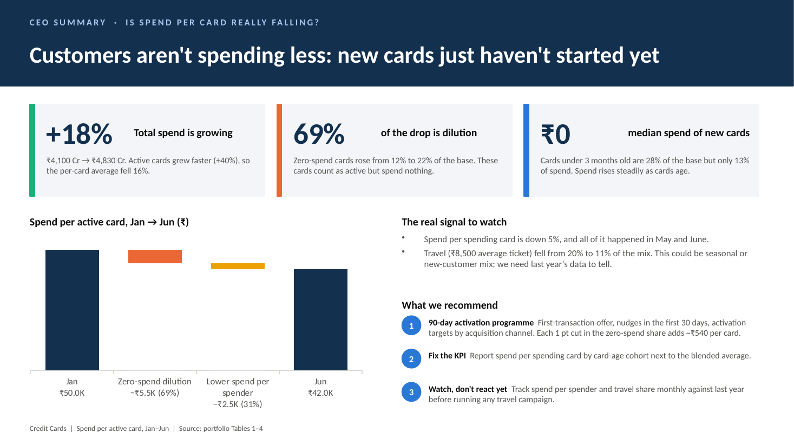
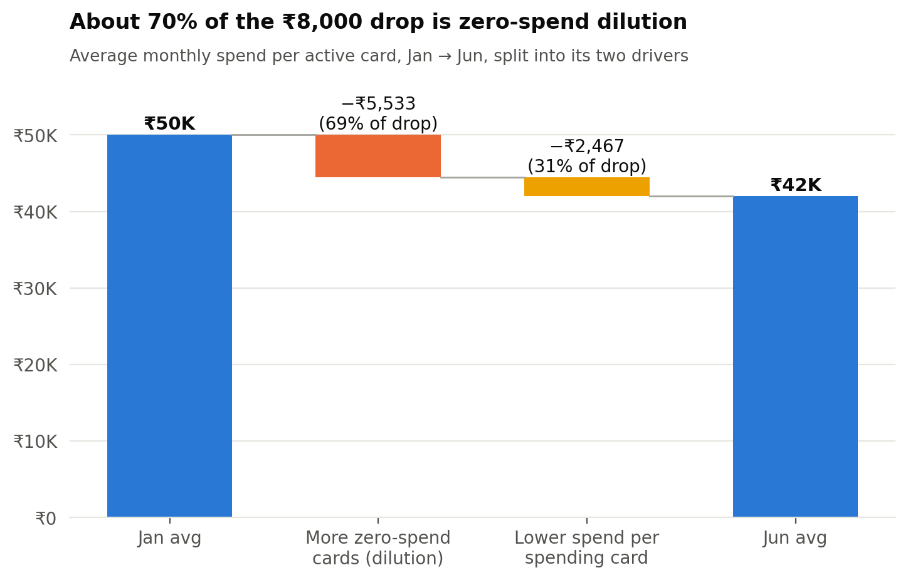
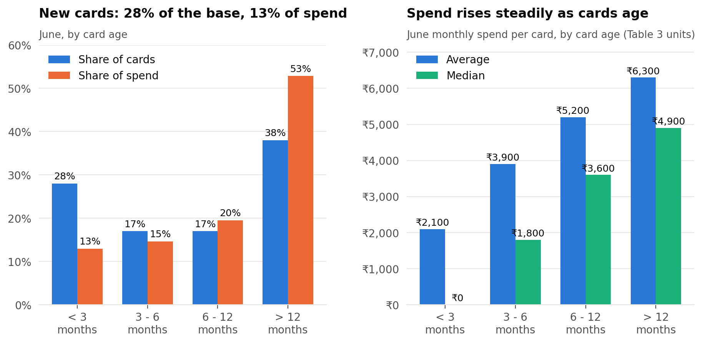

# Is average spend per card really falling?

A data interpretation case study. Leadership believes average spend per active card has fallen meaningfully over the last six months. This repo gives a fact-based explanation before anyone acts on it.



---

## Answers

### Q1. Is the spend decline real or mechanical?

**Mostly mechanical, with a smaller real component that only started in May–June.**

* Average spend per active card fell **16%** (₹50.0K → ₹42.0K), but **total spend grew 18%** (₹4,100 Cr → ₹4,830 Cr).
* Active cards grew **40%**, and the zero-spend share rose from **12% to 22%**. New cards enter the denominator before they start spending.
* Splitting the ₹8,000 drop into its two drivers (Shapley split): **69% is zero-spend dilution** (mechanical) and **31% is lower spend per spending card** (real).
* Spend per *spending* card was flat at about ₹57K from January to April and fell about 6% in May–June. That's the real part, and it coincides with travel's share of the mix falling from 20% to 11%.



### Q2. The single biggest driver

**Fast new-card acquisition, with cards slow to start spending.**

* Cards under 3 months old are **28% of the base** but only **13% of spend**, and their **median spend is ₹0**.
* That means at least 161K new cards spent nothing in June. That's **at least 64% of all zero-spend cards**, and more than the entire January-to-June rise in zero-spend cards (+155K).
* Spend rises steadily with card age (₹2.1K → ₹3.9K → ₹5.2K → ₹6.3K). New cards haven't stopped spending; they simply haven't started yet.



### Q3. One-slide CEO summary

[`reports/CEO_summary.pptx`](reports/CEO_summary.pptx) (image above; talking points are in the speaker notes).

**Recommendations**

1. **90-day activation programme:** a first-transaction offer, nudges in the first 30 days, and activation targets for each acquisition channel. Each 1-point cut in the zero-spend share adds about ₹540 per active card.
2. **Fix the KPI:** report spend per *spending* card by card-age cohort next to the blended average, so growth stops looking like decline.
3. **Watch the real signal before reacting:** track spend per spender and travel share monthly, and compare with last year to rule out seasonality.

---

## Data checks to raise

The tables don't fully reconcile. These points don't change the direction of the findings, because every conclusion uses relative measures (shares and % changes):

| Check | Finding |
|---|---|
| June spend per active card | Table 1: **₹42,000**. Table 3: **₹4,529** (about 9× lower). Table 2's buckets imply **at least ₹5,750**. The units or the definition of "active" differ between tables. |
| New cards | 385K cards were added in April–June, but Table 3 shows only 322K under-3-month cards in the active base. About 63K new cards may not count as active at all. |
| Cards leaving the base | Previous month's active + new − current active ≈ **225K cards** over five months (about 4–5% a month). Are these closures or a definition effect? |
| Category shares | Are they by spend value or by transaction count? The 22% "average ticket" effect assumes transaction count. |

**Data that would sharpen this:** monthly spend for the same set of cards (a fixed cohort), category mix by card age, and year-on-year figures for seasonality.

---

## Repo structure

```
├── data/raw/                 # the four tables from the case PDF, transcribed to CSV
├── notebooks/
│   └── 01_spend_decline_analysis.ipynb   # full analysis, step by step
├── src/
│   ├── load_data.py          # loading + sanity checks (shares must sum to 100%)
│   ├── metrics.py            # KPI rebuild, Shapley decomposition, vintage & mix analysis, consistency checks
│   └── plots.py              # shared chart style
├── reports/
│   ├── CEO_summary.pptx      # Q3 one-slide summary
│   ├── CEO_summary.png
│   └── figures/              # charts exported by the notebook
└── requirements.txt
```


Running the notebook regenerates every figure in `reports/figures/`.

## Method notes

* **KPI identity:** spend per active card = (1 − zero-spend share) × spend per spending card. This separates *activation* (mechanical) from *engagement* (real).
* **Shapley (midpoint) split:** Δ(a·b) = Δa · mean(b) + Δb · mean(a). The two effects add up exactly to the total change and don't depend on which factor is changed first.
* **Vintage mix scenarios:** each cohort's June spend is held fixed while the new-card share varies, which isolates the pure mix effect.
